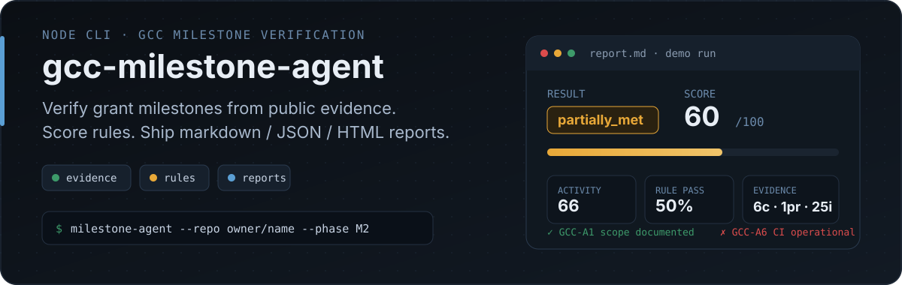
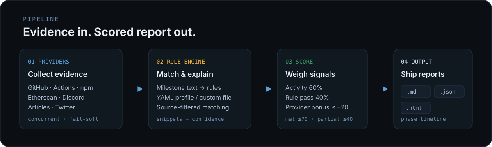

<p align="center">
  
</p>

# gcc-milestone-agent

**CLI agent for GCC milestone verification.** Collect multi-source public evidence, evaluate rules, score progress, and write markdown / JSON / HTML reports reviewers can audit.

中文说明：[简明版](./README.zh-CN.quick.md) · [详细版](./README.zh-CN.full.md)

## Sponsor

Sponsored by [GCC](https://www.gccofficial.org/) (Global Chinese Community of Universal Digital Commons) — a Chinese-speaking public goods funding community for digital commons, open-source, privacy, security, and decentralized governance.

- Website: [gccofficial.org](https://www.gccofficial.org/)
- X/Twitter: [@GCCofCommons](https://x.com/GCCofCommons)

## What you get

<p align="center">
  
</p>

| Result | Meaning |
|--------|---------|
| **Evidence** | Commits, PRs, issues, CI, npm, contracts, articles, Discord, Twitter, and more — concurrent providers, one failure does not block the rest |
| **Rules** | Milestone text or YAML profiles (`gcc-allocation` / custom `--rules-file`) with source filters and evidence snippets |
| **Score** | Activity 60% + rule pass rate 40% + provider bonus (up to +20). Thresholds: met ≥70, partially_met ≥40 |
| **Reports** | Markdown, JSON, interactive HTML (filters + reviewer dashboard + phase timeline) |

## Quick start

```bash
npm install

# Basic: markdown report from GitHub evidence
node src/cli.js \
  --repo gcc-foundation/gcc-openclaw-grants \
  --milestone "submission template, issue discussion, open source workflow" \
  --since 2026-03-01 \
  --out ./demo-report.md
```

Optional binary name after install / link: `milestone-agent`.

### GCC profile (markdown + JSON)

```bash
node src/cli.js \
  --repo gcc-foundation/gcc-openclaw-grants \
  --milestone "GCC allocation verification" \
  --profile gcc-allocation \
  --since 2026-03-01 \
  --out ./demo-gcc-report.md \
  --json-out ./demo-gcc-report.json
```

### Multi-source + HTML

```bash
node src/cli.js \
  --repo gcc-foundation/gcc-openclaw-grants \
  --milestone "GCC allocation verification" \
  --profile gcc-allocation \
  --providers github-api,github-actions,github-community,npm-registry,url-checker \
  --since 2026-03-01 \
  --out ./demo-full-report.md \
  --json-out ./demo-full-report.json \
  --html-out ./demo-full-report.html
```

### Web3 / community signals

```bash
node src/cli.js \
  --repo SomeOrg/SomeWeb3Repo \
  --milestone "Deploy smart contract, write documentation, reach 1000 members" \
  --contract-address "0x1234567890abcdef" \
  --article-urls "https://mirror.xyz/my-post" \
  --discord-invite "discord-developers" \
  --twitter-handle "vitalikbuterin" \
  --providers github-api,etherscan-api,article-crawler,discord-api,twitter-browser \
  --out ./demo-web3-report.md
```

### Optional LLM semantic mode

```bash
OPENAI_API_KEY=your_openai_key node src/cli.js \
  --repo gcc-foundation/gcc-openclaw-grants \
  --milestone "GCC allocation verification" \
  --profile gcc-allocation \
  --semantic-mode llm \
  --llm-model gpt-5-mini \
  --since 2026-03-01 \
  --out ./demo-llm-report.md
```

LLM mode is assistive — keep human review for final decisions.

## Providers

| Provider | What it collects |
|----------|------------------|
| `github-api` | Commits, PRs, issues, releases |
| `github-actions` | CI/CD workflow runs, success rate |
| `github-community` | Stars, forks, contributors |
| `github-discussions` | Discussion threads and top participants |
| `npm-registry` | Package publish status |
| `url-checker` | README external URL reachability |
| `etherscan-api` | Contract creation date and open-source status |
| `article-crawler` | Full-text extraction (Mirror, Notion, …) via Playwright |
| `discord-api` | Approximate members & online count (no bot token) |
| `twitter-browser` | Profile metrics via Playwright + optional Vision AI |

Default provider list is `github-api`. Pass a comma-separated `--providers` list to expand.

## Phase-based milestones

Define phases in `.gcc-milestone.yaml` (or pass `--config <path>`):

```yaml
repo: owner/name
profile: gcc-allocation
reportsDir: reports
milestones:
  - id: M1
    title: Foundation
    milestone: "Set up repo and publish submission template"
  - id: M2
    title: Community proof
    milestone: "Reach active community discussions"
    dependsOn: M1
```

```bash
node src/cli.js --phase M2
```

- Phase mode is **opt-in**. Without `--phase`, use single-run `--milestone` as usual.
- Dependency lookup reads prior phase JSON under `reportsDir`. Missing or `not_met` dependencies **warn** but do not block.
- Phase runs compile a **Phase Progress Timeline** in markdown and HTML.
- Default outputs become timestamped files under `reportsDir` (explicit `--out` / `--json-out` / `--html-out` still win). A phase-aware JSON copy is always written for the next dependency check.

## CLI options

| Option | Description |
|--------|-------------|
| `--repo <owner/name>` | Required target repository |
| `--milestone <text>` | Required milestone text (single-run mode) |
| `--config <path>` | YAML config (default `.gcc-milestone.yaml`) |
| `--phase <id>` | Phase id from config |
| `--since <ISO date>` | Activity window start |
| `--out <path>` | Markdown report (default `./report.md`) |
| `--json-out <path>` | JSON report |
| `--html-out <path>` | HTML report |
| `--reports-dir <path>` | Phase reports / dependency dir (default `reports`) |
| `--rules-file <path>` | External YAML rules (overrides `--profile`) |
| `--profile <name>` | Built-in profile (`gcc-allocation`) |
| `--providers <list>` | Comma-separated providers |
| `--contract-address <address>` | Smart contract for `etherscan-api` |
| `--etherscan-url <url>` | Etherscan-compatible API URL |
| `--article-urls <urls>` | Comma-separated article URLs |
| `--discord-invite <code_or_url>` | Discord invite for community metrics |
| `--twitter-handle <handle>` | Twitter handle for `twitter-browser` |
| `--telegram-group <username_or_url>` | Telegram group for community metrics |
| `--batch <path>` | Batch config file path |
| `--semantic-mode <mode>` | `heuristic` (default) or `llm` |
| `--llm-model <name>` | OpenAI model when semantic mode is `llm` |

CLI flags override config. Config keys use camelCase (`rulesFile`, `jsonOut`, `htmlOut`, `reportsDir`).

### Rules YAML shape

```yaml
rules:
  - id: R1
    text: Description of the rule
    keywords: [keyword1, keyword2]
    source: github-api   # optional; must match PROVIDER_SOURCES exactly
```

## Environment

```bash
export GITHUB_TOKEN=your_github_pat   # or GH_TOKEN — higher GitHub rate limits
export ETHERSCAN_API_KEY=your_key     # contract verification
export OPENAI_API_KEY=your_key        # --semantic-mode llm + Twitter Vision AI
```

Browser providers (article crawler, Twitter) need Chromium once:

```bash
npx playwright install chromium
```

## Quality checks

```bash
npm test
npm run pack:check
npm run demo
npm run demo:gcc
npm run demo:html
```

## Status

**v0.4.0** — multi-provider evidence, YAML / profile rules, scoring with explainability, markdown + JSON + HTML reports, phase milestones with dependency warnings and timeline, optional LLM semantic assist.

Frontend under `frontend/` is a separate Vite + React + Tauri app (not part of the CLI package).

## License

MIT. See [LICENSE](./LICENSE).
